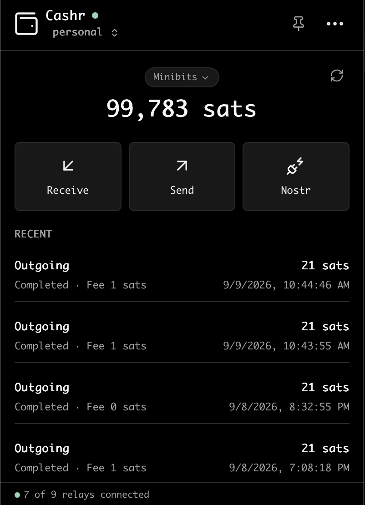

# Cashr

A Cashu wallet and Nostr signer for your macOS menu bar.

Keep your wallet and Nostr identity in one app. Connect Nostr clients, approve
signatures, send zaps, and pay Lightning invoices while Cashr runs in the background.

[Download the beta](https://github.com/rayfish/cashr/releases) · [Report an issue](https://github.com/rayfish/cashr/issues)



## Features

### Cashu wallet

- **One recovery phrase:** create or restore a wallet and its Nostr identity from 12 words.
- **Tokens and Lightning:** send and receive Cashu tokens, fund your wallet, and pay Lightning invoices.
- **Multiple accounts and mints:** keep separate identities and choose which mint holds each balance.
- **Payment history:** see recent payments, fees, and pending transactions.
- **Background receiving:** incoming payments are claimed while Cashr is awake and unlocked, even with the window closed.

### Nostr signing and zaps

- **Connect your apps:** pair with `bunker://`, `nostrconnect://`, or a QR code without giving the app your private key.
- **Approve requests:** review signing requests in Cashr or respond through macOS notifications.
- **Per-app permissions:** remember individual decisions or use **Allow all**, **Deny all**, and **Forget all**.
- **Nostr Wallet Connect:** connect apps for zaps, with a separate approval for every payment.
- **Lightning addresses:** set up an npub.cash address or claim a readable name for receiving zaps.

### Built for the menu bar

- Unlock with **Touch ID or your Mac login password**.
- Scan QR codes from your **screen or clipboard**, with decoding performed locally.
- Pin the window open or let it hide when you switch away.
- Keep signer connections alive with relay heartbeats and automatic reconnection.

## Install and get started

Beta downloads support **Apple Silicon Macs running macOS 12 or later**.

1. Download a build from [Releases](https://github.com/rayfish/cashr/releases), extract the ZIP or open the DMG, and move `Cashr.app` into Applications.
2. Open Cashr and choose **Create wallet** or **Import wallet**. Save your recovery words.
3. Use **Receive** to fund your wallet, **Send** to make a payment, or **Nostr** to connect an app.

Builds are self-signed and not notarized by Apple. If macOS blocks the download
or app, use **System Settings → Privacy & Security → Open Anyway** after attempting
to open it. See [installation and signing details](.github/SIGNING.md).

## NIP support

| NIP | What Cashr supports |
| --- | --- |
| NIP-01 | Event signing, relay subscriptions, and publishing. |
| NIP-04 | Legacy message encryption and decryption. |
| NIP-06 | Nostr identity derived from the wallet recovery phrase. |
| NIP-19 | Bech32 Nostr identifiers, including `npub` display and link parsing. |
| NIP-42 | Authentication with Nostr relays. |
| NIP-44 | Message encryption and decryption, including NIP-46 transport. |
| NIP-46 | Remote signing through bunker and Nostr Connect pairing. |
| NIP-47 | Nostr Wallet Connect: `get_info`, `get_balance`, and `pay_invoice`. |
| NIP-49 | Encrypted account key storage using `ncryptsec`. |
| NIP-57 | Zap requests and payments through Cashu; receipts are published by the recipient's provider. |

Support covers the features listed, not every operation in each NIP. NWC accepts
NIP-44 and NIP-04 encryption. Remote Lightning wallet import, Lightning channel
recovery, and NIP-60 wallet synchronization are not supported.

## Beta and recovery notes

Cashr is an early beta. Start with a separate identity and a small balance.

- **Mint trust:** each mint holds the bitcoin backing your tokens. Switching mints does not move funds. Deposits and Lightning payments are limited to 10,000 sats per operation.
- **Backups:** save your recovery words, mint URLs, and any BIP-39 passphrase. Also back up `~/Library/Application Support/xyz.rayfish.cashr`, including the local device key. Recovery depends on mint availability and support, and may not recover every pending operation.
- **Local key protection:** account keys and wallet databases are encrypted, but the device password is stored in plaintext in `unlock.passphrase`. Someone who can read that file and the encrypted files can decrypt them. Touch ID is enforced by the app; keys are not protected by Secure Enclave storage.
- **Pending payments:** check transaction history after a timeout before trying again. NWC does not automatically resubmit a payment with an unknown result. Its relay connections do not yet have the signer's pong-timeout detection.

On upgrade, Cashr copies existing data from `com.dgrr.cashr` into the new data
directory on first launch, keeping the original as a backup. Quit any older Cashr
instance before opening the updated app.

## Build from source

Requires macOS, Rust, and `just`.

```sh
just tools    # Install the Tauri CLI
just cert     # Create the local signing identity
just release  # Build, sign, and verify the app and DMG
```

The bundles are written to `src-tauri/target/release/bundle`. Use `just dev` to run
from source; signed builds are needed for notification approval buttons.

```sh
just check                      # Formatting, linting, and core tests
node --test ui/tests/*.test.cjs  # Frontend tests
```

Tagged releases build ZIP and DMG downloads in GitHub Actions. See
[CI signing setup](.github/SIGNING.md) for the release workflow.
